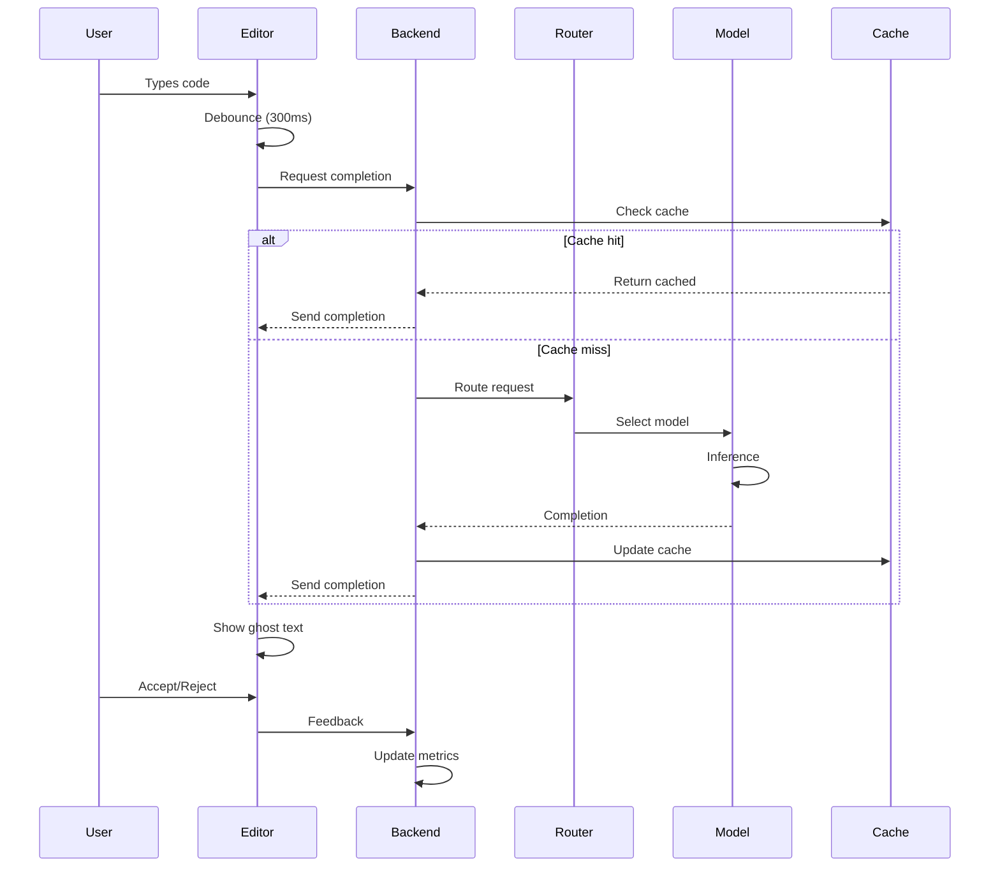
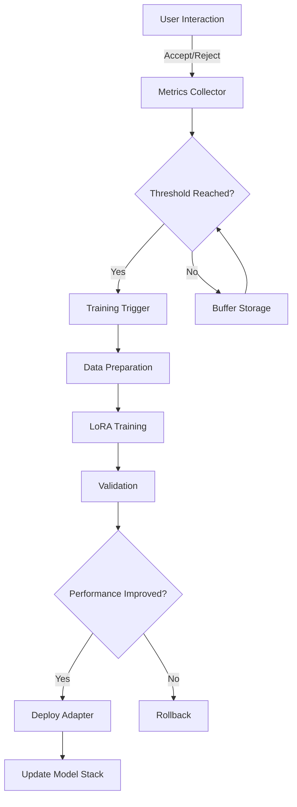
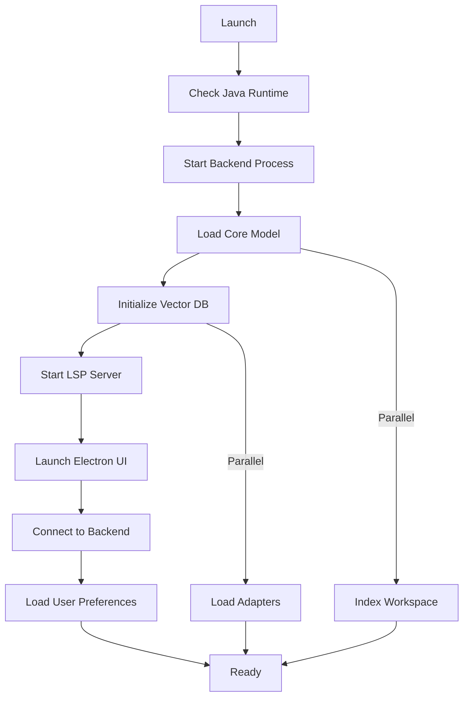

# 🏗️ NeuralForge Architecture

**Status**: Phase 1-2 Complete (Backend), Phase 3 Starting (Tauri IDE)  
**Last Updated**: 2024-10-31

## 🚨 Major Pivot (2024-10-31)

**OLD:** VS Code fork + Electron + Extension API  
**NEW:** Tauri + Monaco + React + Java Backend

**Why?** Simpler, lighter (50MB vs 200MB RAM), full control over features.

---

## Table of Contents
- [Overview](#overview)
- [System Architecture](#system-architecture)
- [Component Design](#component-design)
- [Data Flow](#data-flow)
- [Model Serving Architecture](#model-serving-architecture)
- [Performance Optimizations](#performance-optimizations)
- [Security Architecture](#security-architecture)

---

## Overview

NeuralForge is a **three-layer system**:
1. **Presentation Layer**: Tauri (Rust + React + Monaco Editor)
2. **Service Layer**: Java Spring Boot backend (embedded, IPC via stdin/stdout)
3. **Model Layer**: ONNX-based inference with LoRA adapters

### Design Principles
- **Local-First**: Everything runs on user's machine
- **Lightweight**: Tauri (50MB RAM) vs Electron (200MB RAM)
- **Modular**: Loosely coupled components
- **Reactive**: Event-driven, non-blocking I/O
- **Efficient**: Minimal resource usage through quantization
- **Extensible**: Multi-provider support (local + cloud optional)

---

## System Architecture

```
┌──────────────────────────────────────────────────────────────┐
│                   NeuralForge Desktop App                     │
│                    (Tauri 1.5+ Application)                   │
├──────────────────────────────────────────────────────────────┤
│                                                              │
│  ┌──────────────────────────┐  ┌──────────────────────┐    │
│  │     Monaco Editor         │  │   React UI Layer     │    │
│  │  (VS Code's Editor)       │  │  (Chat, Settings,    │    │
│  │  - Syntax highlighting    │  │   File Explorer)     │    │
│  │  - IntelliSense           │  │                      │    │
│  │  - Ghost Text overlay     │  │                      │    │
│  └────────────┬──────────────┘  └───────────┬──────────┘    │
│               │                              │               │
│  ┌────────────▼──────────────────────────────▼──────────┐   │
│  │              Tauri Rust Backend                       │   │
│  │         (IPC Commands + File Operations)              │   │
│  │  #[tauri::command] completion_request()               │   │
│  │  #[tauri::command] chat_message()                     │   │
│  │  #[tauri::command] file_create/modify/delete()        │   │
│  └────────────────────────┬──────────────────────────────┘   │
│                           │                                  │
├───────────────────────────┼──────────────────────────────────┤
│                           │ IPC (stdin/stdout JSON)          │
└───────────────────────────┼──────────────────────────────────┘
                            │
                ┌───────────▼───────────┐
                │   Java Backend        │
                │  (Spring Boot 3.2)    │
                │  Phase 1-2 ✅ COMPLETE│
                │  86 tests passing     │
                └───────────┬───────────┘
                            │
        ┌───────────────────┼───────────────────┐
        │                   │                   │
┌───────▼───────┐ ┌─────────▼─────────┐ ┌──────▼──────┐
│ InferenceEngine│ │  LearningSystem   │ │  RAG Engine │
│  (ONNX Runtime)│ │ (StyleAnalyzer)   │ │  (Qdrant)   │
│  CodeT5+ 220M  │ │ (PatternDetector) │ │  (Embedded) │
└───────┬───────┘ └─────────┬─────────┘ └──────┬──────┘
        │                   │                   │
        └───────────────────┼───────────────────┘
                            │
                    ┌───────▼───────┐
                    │  Model Store   │
                    │ (File System)  │
                    │ - models/base/ │
                    │ - ~/.neuralforge/│
                    └────────────────┘
```

### Key Differences from Old Architecture
| Component | Old (VS Code Fork) | New (Tauri) |
|-----------|-------------------|-------------|
| **Frontend** | Electron (200MB RAM) | Tauri (50MB RAM) |
| **Editor** | Monaco + VS Code OSS | Monaco standalone |
| **IPC** | JSON-RPC named pipes | stdin/stdout JSON |
| **Extension API** | VS Code Extension Host | Full Rust commands |
| **Binary Size** | ~200MB | ~50MB |
| **Startup** | 5-8s | <3s |

---

## Component Design

### 1. Frontend Components (React + TypeScript + Tauri)

#### Editor Core
```typescript
// Monaco Editor Wrapper
interface EditorCore {
  editor: monaco.editor.IStandaloneCodeEditor;
  
  // AI Features
  ghostText: GhostTextController;       // Inline completions
  completionProvider: CompletionProvider; // Monaco API integration
  debouncer: Debouncer;                  // 500ms delay
  
  // Chat
  chatPanel: ChatPanel;                  // Side panel
  contextManager: ContextManager;         // File + selection context
  
  // Learning
  learningDashboard: LearningDashboard;   // User style display
  
  // Communication
  backend: TauriInvokeAPI;                // invoke() for IPC
}
```

#### Chat Panel
```typescript
interface ChatPanel {
  messages: ChatMessage[];
  providers: Provider[];  // Local, OpenAI, Claude, Gemini, Custom
  
  sendMessage(text: string, context: CodeContext): Promise<ChatResponse>;
  executeCodeActions(actions: FileAction[]): Promise<void>;
  previewChanges(actions: FileAction[]): void;
}
}
```

#### Ghost Text System
```typescript
class GhostTextController {
  private pendingCompletion: Completion | null;
  private confidenceThreshold: number = 0.7;
  
  async requestCompletion(context: CodeContext): Promise<void> {
    // 1. Debounce (300ms)
    // 2. Send context to backend
    // 3. Render ghost text
    // 4. Track acceptance/rejection
  }
}
```

### 2. Backend Components (Java/Spring Boot)

#### Main Application Structure
```java
@SpringBootApplication
@EnableAsync
@EnableCaching
public class NeuralForgeBackend {
    
    @Bean
    public ModelEngine modelEngine() {
        return ModelEngine.builder()
            .primaryModel("codet5-770m")
            .contextModel("stablecode-3b")
            .complexModel("starcoder-15b")
            .build();
    }
    
    @Bean
    public AdapterManager adapterManager() {
        return new LoRAAdapterManager();
    }
}
```

#### AI Service Layer
```java
@Service
public class AIService {
    private final ModelRouter router;
    private final InferenceEngine engine;
    private final AdapterStack adapters;
    private final MetricsCollector metrics;
    
    public Mono<Completion> complete(CodeContext context) {
        return Mono.fromCallable(() -> {
            // 1. Select optimal model
            Model model = router.route(context);
            
            // 2. Apply active adapters
            ModelWithAdapters enhanced = adapters.apply(model);
            
            // 3. Run inference
            Completion result = engine.infer(enhanced, context);
            
            // 4. Collect metrics for learning
            metrics.record(context, result);
            
            return result;
        })
        .subscribeOn(Schedulers.parallel())
        .timeout(Duration.ofMillis(100));
    }
}
```

#### Model Router
```java
@Component
public class SmartModelRouter {
    
    public Model route(CodeContext context) {
        // Decision tree for model selection
        if (context.requiresLongContext()) {
            return models.get("stablecode-3b");  // 16K context
        }
        
        if (context.complexity > 0.8) {
            return models.get("starcoder-15b");  // Most capable
        }
        
        if (context.isQuickCompletion()) {
            return models.get("codet5-770m");    // Fastest
        }
        
        // Swarm mode: use multiple models
        if (context.useSwarmIntelligence) {
            return new SwarmModel(Arrays.asList(
                models.get("codet5-770m"),
                models.get("santacoder-1b"),
                models.get("tinystories-33m")
            ));
        }
        
        return defaultModel;
    }
}
```

### 3. Model Layer (ONNX/DJL)

#### Inference Engine
```java
@Component
public class ONNXInferenceEngine {
    private final OrtEnvironment env;
    private final Map<String, OrtSession> sessions;
    
    public Completion infer(Model model, CodeContext context) {
        // 1. Tokenize input
        long[] tokens = tokenizer.encode(context.getPrompt());
        
        // 2. Create ONNX tensors
        OnnxTensor inputTensor = OnnxTensor.createTensor(
            env, 
            tokens,
            new long[]{1, tokens.length}
        );
        
        // 3. Run inference
        OrtSession.Result result = sessions.get(model.getName())
            .run(Map.of("input_ids", inputTensor));
        
        // 4. Decode output
        String completion = tokenizer.decode(result);
        
        // 5. Apply post-processing
        return postProcess(completion, context);
    }
}
```

#### LoRA Adapter System
```java
public class LoRAAdapter {
    private final String name;
    private final int rank;           // r value (4, 8, 16)
    private final float alpha;         // scaling factor
    private final float[][] weightsA;  // Down projection
    private final float[][] weightsB;  // Up projection
    
    public Tensor apply(Tensor input) {
        // LoRA: h = Wx + BAx
        Tensor down = matmul(input, weightsA);  // Reduce dimension
        Tensor up = matmul(down, weightsB);     // Restore dimension
        return input.add(up.multiply(alpha / rank));
    }
}
```

---

## Data Flow

### Completion Request Flow


### Learning Pipeline Flow


---

## Model Serving Architecture

### Model Loading Strategy
```yaml
Lazy Loading:
├── Core model (770M): Loaded at startup
├── Context model (3B): Loaded on first use
├── Complex model (15B): Loaded on demand
└── Tiny models (33M): Always in memory

Memory Management:
├── Quantization: INT4 for large models
├── KV Cache: 512MB max per model
├── Model unloading: LRU policy
└── Shared weights: Between adapters
```

### Quantization Pipeline
```python
# Model conversion script
def quantize_model(model_path, output_path, bits=4):
    """
    FP16 → INT8 → INT4 progressive quantization
    """
    model = load_model(model_path)
    
    # Step 1: Dynamic range quantization
    calibration_data = load_calibration_set()
    ranges = calculate_ranges(model, calibration_data)
    
    # Step 2: Symmetric quantization
    quantized = quantize_symmetric(model, ranges, bits)
    
    # Step 3: Optimize for ONNX
    optimized = optimize_for_inference(quantized)
    
    # Step 4: Validate accuracy
    assert validate_accuracy(optimized) > 0.95
    
    save_onnx(optimized, output_path)
```

### Adapter Composition
```java
public class AdapterStack {
    private final List<LoRAAdapter> adapters;
    private final WeightCalculator calculator;
    
    public Model compose() {
        // Weighted combination of adapters
        // W_final = W_base + Σ(αi * LoRAi)
        
        float[] weights = calculator.calculate(adapters);
        Model combined = baseModel.clone();
        
        for (int i = 0; i < adapters.size(); i++) {
            combined.addAdapter(
                adapters.get(i), 
                weights[i]
            );
        }
        
        return combined;
    }
}
```

---

## Learning Pipeline

**Status**: Planned Feature

The incremental learning system is a key planned feature that will allow NeuralForge to adapt to individual coding styles. This section describes the intended design.

### Planned Incremental Learning Architecture
```java
@Component
public class IncrementalLearner {
    private final ExperienceReplay buffer;
    private final EWCRegularizer ewc;
    private final TrainingScheduler scheduler;
    
    @Scheduled(fixedDelay = 3600000)  // Every hour
    public void trainIncremental() {
        if (!shouldTrain()) return;
        
        // 1. Prepare training data
        TrainingBatch batch = prepareData();
        
        // 2. Calculate importance weights (EWC)
        FisherMatrix fisher = ewc.calculateFisher(
            currentModel, 
            previousData
        );
        
        // 3. Fine-tune with regularization
        LoRAAdapter newAdapter = train(
            batch,
            regularization = fisher
        );
        
        // 4. Validate improvement
        if (validate(newAdapter) > currentAccuracy) {
            deployAdapter(newAdapter);
        }
    }
}
```

### Training Data Pipeline
```yaml
Data Sources:
├── Accepted completions (weight: 1.0)
├── Rejected completions (weight: -0.5)
├── Manual corrections (weight: 2.0)
├── Git commits (weight: 1.5)
├── Test results (weight: 1.0)
└── Code reviews (weight: 1.5)

Processing:
├── Tokenization (CodeT5 tokenizer)
├── Context extraction (±5 lines)
├── Deduplication (MinHash)
├── Balancing (up/down sampling)
└── Augmentation (variable renaming)
```

---

## Performance Optimizations

### 1. Speculative Decoding
```java
public class SpeculativeDecoder {
    private final Model draftModel;   // Tiny (33M)
    private final Model targetModel;  // Large (3B)
    
    public String decode(String prompt) {
        // Draft model generates K tokens quickly
        List<Token> draft = draftModel.generate(prompt, K=5);
        
        // Target model verifies in parallel
        List<Token> verified = targetModel.verify(draft);
        
        // Accept verified tokens, regenerate rest
        return combineResults(verified, draft);
    }
}
```

### 2. KV Cache Optimization
```java
public class KVCache {
    private final int maxSize = 512_000_000;  // 512MB
    private final Map<CacheKey, Tensor> cache;
    
    public Tensor get(String prompt, int layer) {
        CacheKey key = hash(prompt, layer);
        return cache.computeIfAbsent(key, k -> 
            computeAttention(prompt, layer)
        );
    }
}
```

### 3. Parallel Inference
```java
@Configuration
public class ParallelInferenceConfig {
    
    @Bean
    public ExecutorService inferenceExecutor() {
        return new ForkJoinPool(
            Runtime.getRuntime().availableProcessors(),
            ForkJoinPool.defaultForkJoinWorkerThreadFactory,
            null,
            true  // Async mode
        );
    }
}
```

---

## Security Architecture

### Sandboxing
```java
public class ModelSandbox {
    private final SecurityManager manager;
    
    public void execute(Runnable modelCode) {
        // Restrict file system access
        Policy restrictedPolicy = new Policy() {
            public PermissionCollection getPermissions(CodeSource cs) {
                Permissions perms = new Permissions();
                // Only allow model directory access
                perms.add(new FilePermission(
                    "/models/*", "read"
                ));
                return perms;
            }
        };
        
        Policy.setPolicy(restrictedPolicy);
        System.setSecurityManager(manager);
        
        try {
            modelCode.run();
        } finally {
            System.setSecurityManager(null);
        }
    }
}
```

### Adapter Verification
```java
public class AdapterVerifier {
    
    public boolean verify(byte[] adapterFile) {
        // 1. Check signature
        if (!checkSignature(adapterFile)) {
            return false;
        }
        
        // 2. Validate structure
        if (!validateStructure(adapterFile)) {
            return false;
        }
        
        // 3. Scan for malicious patterns
        if (detectMaliciousPatterns(adapterFile)) {
            return false;
        }
        
        // 4. Test in sandbox
        return sandboxTest(adapterFile);
    }
}
```

---

## Deployment Architecture

### Distribution Package Structure
```
neuralforge/
├── bin/
│   ├── neuralforge.exe          # Windows launcher
│   ├── neuralforge               # Unix launcher
│   └── neuralforge.app/          # macOS bundle
├── app/
│   ├── electron/                 # Frontend
│   ├── backend.jar               # Java backend
│   └── resources/                # Static assets
├── models/
│   ├── core/                     # Pre-installed models
│   │   ├── codet5-770m.onnx
│   │   └── tokenizer.json
│   ├── available/                # Downloadable models
│   └── user/                     # User's adapters
├── jre/                          # Embedded Java runtime
│   └── bin/
│       └── java
└── config/
    ├── default.yaml               # Default settings
    └── models.yaml                # Model registry
```

### Resource Allocation
```yaml
Memory Budget (3GB Total):
├── Electron Process: 500MB
├── Java Backend: 500MB
├── Model (Quantized): 1GB
├── KV Cache: 512MB
├── Vector DB: 256MB
└── Buffer/Overhead: 256MB

CPU Allocation:
├── Main Thread: UI only
├── Worker Thread 1: Model inference
├── Worker Thread 2: Background learning
└── Worker Thread 3-N: Parallel tasks
```

### Startup Sequence


---

## Technical Decisions

### Why These Choices?

| Decision | Choice | Rationale |
|----------|--------|-----------|
| **Frontend** | VS Code Fork | Proven editor, huge ecosystem |
| **Backend** | Java + Spring Boot | JVM performance, enterprise ready |
| **AI Framework** | DJL + ONNX | Cross-platform, optimized inference |
| **Vector DB** | Qdrant | Apache 2.0, embedded mode |
| **IPC** | Named Pipes | Fast, secure, cross-platform |
| **Models** | ONNX Format | Hardware acceleration, portable |
| **Fine-tuning** | LoRA | Efficient, composable, small |
| **Quantization** | INT4 | 75% size reduction, minimal accuracy loss |

### Trade-offs

| Trade-off | Decision | Impact |
|-----------|----------|--------|
| Speed vs Accuracy | INT4 quantization | -2% accuracy, 3x faster |
| Memory vs Features | 3GB limit | Some features lazy-loaded |
| Privacy vs Convenience | 100% local | No cloud features |
| Size vs Capability | SLM focus | Less capable than GPT-4, but fast |

---

## Monitoring & Metrics

### Performance Metrics
```java
@Component
public class MetricsCollector {
    
    private final MeterRegistry registry;
    
    @EventListener
    public void recordCompletion(CompletionEvent event) {
        registry.timer("completion.latency")
            .record(event.getLatency());
        
        registry.counter("completion.total")
            .increment();
        
        if (event.isAccepted()) {
            registry.counter("completion.accepted")
                .increment();
        }
        
        registry.gauge("model.memory", 
            Runtime.getRuntime().totalMemory()
        );
    }
}
```

### Health Checks
```java
@Component
public class HealthMonitor {
    
    public HealthStatus checkHealth() {
        return HealthStatus.builder()
            .withDetail("models", modelHealth())
            .withDetail("memory", memoryHealth())
            .withDetail("inference", inferenceHealth())
            .build();
    }
}
```

**Note**: Health checks are internal monitoring, not exposed as REST endpoints. This is a desktop application.

---

## Future Considerations

### Planned Advanced Features

These features are on the roadmap for future development:

1. **Incremental Learning**: Real-time model adaptation from user feedback
2. **Swarm Intelligence**: Multiple model consensus mechanisms
3. **Time Travel Debugging**: Pattern-based bug prediction from history
4. **Federated Learning**: Privacy-preserving community improvements
5. **WebAssembly Support**: Compile models to WASM for portability
6. **GPU Acceleration**: CUDA/Metal/ROCm backend support

### Extension Points
- Custom model loaders
- Plugin API for UI extensions
- Custom training strategies
- Alternative vector stores
- Remote development support

---

*This architecture document describes planned designs for NeuralForge. Implementation status and details may change as development progresses.*