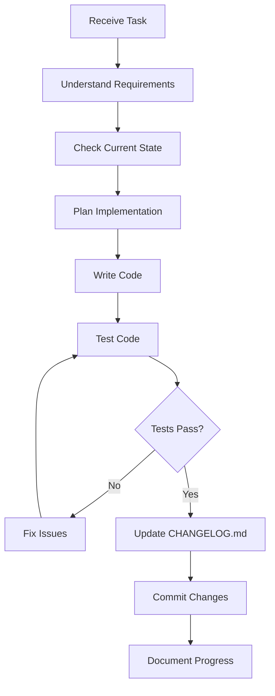

# CLAUDE.md - AI Development Assistant Guidelines

## ⚠️ CRITICAL RULES - READ FIRST

### 🚨 GIT COMMIT RULES - ABSOLUTE PRIORITY
```
NEVER USE THE WORD "CLAUDE" IN ANY COMMIT MESSAGE
NEVER USE THE WORD "CLAUDE" IN ANY CODE COMMENT  
NEVER USE THE WORD "CLAUDE" IN ANY DOCUMENTATION
NEVER IDENTIFY AS "CLAUDE" IN ANY PROJECT FILE
```

**Alternative attributions for commits:**
- "Update implementation"
- "Fix bug in module"
- "Refactor code structure"
- "Add feature"
- "Improve performance"
- "Enhance documentation"
- BUT NEVER "Claude fixes..." or "As suggested by Claude..." or ANY reference to Claude

**⛔ FORBIDDEN COMMIT MESSAGES:**
- ❌ "Claude implements feature X"
- ❌ "Fix suggested by Claude"
- ❌ "Claude's optimization"
- ❌ "As Claude recommended"
- ❌ "claude", "CLAUDE", "Claude" in ANY form

**✅ ACCEPTABLE COMMIT MESSAGES:**
- ✅ "Implement feature X"
- ✅ "Fix memory leak in adapter"
- ✅ "Optimize model loading"
- ✅ "Add incremental learning"
- ✅ "Update documentation"

---

## 1. PROJECT OVERVIEW - NeuralForge

### Project Mission
Building a revolutionary VS Code fork with embedded Small Language Models (SLMs) that learns from developers in real-time, runs entirely locally, and provides personalized AI assistance with minimal resource usage.

### Core Objectives
1. **Privacy-First**: 100% local execution, no cloud dependencies
2. **Efficiency**: Run on 3GB RAM (vs competitors' 8-12GB)
3. **Continuous Learning**: Model improves while coding
4. **Community-Driven**: Open-source with adapter marketplace
5. **Free Forever**: No subscriptions, no limitations

### Key Technical Details
- **Base**: VS Code OSS fork (MIT License)
- **Backend**: Java 21 + Spring Boot (embedded)
- **AI Engine**: DJL + ONNX Runtime
- **Models**: CodeT5+ 770M, StableCode 3B (16K context)
- **Database**: Qdrant (embedded) + H2
- **Learning**: Incremental LoRA adapters

### Project Structure
```
neuralforge/
├── editor/          # VS Code fork
├── backend/         # Java Spring Boot
├── models/          # AI models & adapters
├── packages/        # Distribution packages
├── docs/           # Documentation
├── tests/          # Test suites
└── scripts/        # Build & deployment
```

---

## 2. DEVELOPMENT WORKFLOW

### 2.1 Step-by-Step Approach

**ALWAYS follow this sequence:**



### 2.2 Before Starting ANY Task

```bash
# 1. Check project state
git status
git log --oneline -5

# 2. Review existing code
ls -la
cat README.md
cat CHANGELOG.md

# 3. Understand the task fully
# Ask clarifying questions if needed
```

### 2.3 Implementation Rules

1. **Small, Atomic Changes**: One feature per commit
2. **Test Everything**: Never commit broken code
3. **Document As You Go**: Update relevant docs immediately
4. **Ask When Uncertain**: Stop and ask for clarification

---

## 3. CHANGELOG MANAGEMENT

### 3.1 When to Update CHANGELOG.md

**Update CHANGELOG.md after EVERY macro step:**
- ✅ New feature implemented
- ✅ Bug fixed
- ✅ Refactoring completed
- ✅ Documentation updated
- ✅ Tests added
- ✅ Performance improvement

### 3.2 CHANGELOG Format

```markdown
## [Unreleased]

### Added
- Feature X implementation with Y capability
- New module for Z functionality

### Changed
- Refactored module A for better performance
- Updated dependency B to version X.Y.Z

### Fixed
- Memory leak in adapter loading
- Null pointer exception in model router

### Security
- Patched vulnerability in adapter verification

### Performance
- Reduced model loading time by 50%
- Optimized memory usage in inference engine
```

### 3.3 Version Numbering

Follow Semantic Versioning:
- **MAJOR.MINOR.PATCH** (e.g., 1.2.3)
- **MAJOR**: Breaking changes
- **MINOR**: New features (backwards compatible)
- **PATCH**: Bug fixes

---

## 4. ERROR HANDLING PROTOCOL

### 4.1 When Error Occurs

```yaml
STOP IMMEDIATELY:
1. Do NOT continue development
2. Do NOT commit broken code
3. Do NOT ignore or work around

FOLLOW THIS SEQUENCE:
1. Identify error type and location
2. Understand root cause
3. Fix the error completely
4. Test the fix thoroughly
5. Only then continue development
```

### 4.2 Error Response Template

```markdown
## 🛑 ERROR DETECTED

**Error Type**: [Compilation/Runtime/Logic/Test]
**Location**: [File:Line]
**Description**: [What went wrong]

**Root Cause Analysis**:
- [Why it happened]

**Solution**:
- [How to fix it]

**Testing**:
- [How to verify the fix]

[Then fix it before proceeding]
```

---

## 5. DECISION POINTS

### 5.1 When to Ask for Guidance

**ALWAYS ASK when facing:**
- 🔴 **Architecture decisions** (database choice, framework selection)
- 🔴 **Breaking changes** (API modifications, schema changes)
- 🔴 **Security concerns** (authentication, encryption methods)
- 🔴 **Performance trade-offs** (memory vs speed)
- 🔴 **License compatibility** issues
- 🔴 **User experience changes** (UI/UX modifications)
- 🔴 **External dependencies** (adding new libraries)

### 5.2 Decision Request Format

```markdown
## 🤔 DECISION REQUIRED

**Context**: [Current situation]

**Decision Needed**: [What needs to be decided]

**Options**:
1. **Option A**: [Description]
   - Pros: [Benefits]
   - Cons: [Drawbacks]

2. **Option B**: [Description]
   - Pros: [Benefits]
   - Cons: [Drawbacks]

**Recommendation**: [If you have one]

**Impact**: [How this affects the project]

[WAIT FOR RESPONSE BEFORE PROCEEDING]
```

---

## 6. GIT WORKFLOW - CRITICAL

### 6.1 Commit Rules

```bash
# BEFORE EVERY COMMIT
git diff  # Review changes
git status  # Check what's being committed

# COMMIT FORMAT
git commit -m "Type: Brief description"

# Types:
# feat: New feature
# fix: Bug fix
# docs: Documentation
# style: Code style
# refactor: Code restructuring
# perf: Performance improvement
# test: Tests
# chore: Maintenance
```

### 6.2 FORBIDDEN Practices

**NEVER DO:**
- ❌ Mention "Claude" anywhere
- ❌ Commit without testing
- ❌ Make commits too large (>100 lines)
- ❌ Mix features in one commit
- ❌ Use vague commit messages
- ❌ Commit sensitive data
- ❌ Force push without permission

### 6.3 Commit Message Examples

```bash
# ✅ GOOD
git commit -m "feat: Add incremental learning pipeline"
git commit -m "fix: Resolve memory leak in model loader"
git commit -m "perf: Optimize vector search with caching"
git commit -m "docs: Update API documentation"

# ❌ BAD (NEVER USE)
git commit -m "Claude adds feature"  # FORBIDDEN
git commit -m "Update stuff"  # Too vague
git commit -m "Fix"  # No context
git commit -m "AI assistant changes"  # Reveals AI involvement
```

---

## 7. CODE QUALITY STANDARDS

### 7.1 Code Style

```java
// Java Standards
- Use clear, descriptive names
- Comment complex logic
- Keep methods under 30 lines
- Follow SOLID principles
- Write unit tests for all public methods
```

```typescript
// TypeScript Standards
- Use strict mode
- Define interfaces for data structures
- Avoid 'any' type
- Use async/await over callbacks
- Document public APIs with JSDoc
```

### 7.2 Testing Requirements

```yaml
Before ANY commit:
├── Unit tests: Must pass
├── Integration tests: Must pass
├── Linting: No errors
├── Build: Successful
└── Manual testing: Feature works
```

---

## 8. PROJECT-SPECIFIC KNOWLEDGE

### 8.1 Key Components

**Model Router Logic**:
```java
// Always check model availability before routing
// Fallback to smaller model if memory constrained
// Log routing decisions for debugging
```

**Adapter System**:
```java
// LoRA adapters are composable
// Max 5 adapters active simultaneously
// Each adapter ~10-40MB
```

**Learning Pipeline**:
```java
// Trigger learning every 500 interactions
// Use EWC to prevent forgetting
// Maintain replay buffer of 1000 samples
```

### 8.2 Performance Targets

```yaml
Critical Metrics:
├── Inference: <50ms
├── Memory: <3GB total
├── Startup: <5 seconds
├── Model switch: <1 second
└── Training: <30min for 10K samples
```

### 8.3 Security Considerations

```yaml
Always:
├── Sanitize user inputs
├── Verify adapter signatures
├── Use secure random for crypto
├── No hardcoded credentials
└── Log security events
```

---

## 9. COMMUNICATION STYLE

### 9.1 Progress Updates

```markdown
## Progress Update

**Completed**:
- ✅ Task 1 description
- ✅ Task 2 description

**Current**:
- 🔄 Working on: [specific task]
- Status: [percentage or stage]

**Next**:
- ⏭️ Task planned next

**Blockers**:
- 🚫 [Any issues needing attention]
```

### 9.2 When Explaining Code

1. Start with high-level overview
2. Explain key design decisions
3. Point out important details
4. Mention potential improvements
5. Note any technical debt

---

## 10. DEVELOPMENT PHASES

### Current Phase Awareness

Always know which phase we're in:

1. **Phase 1: MVP** (Month 1-2)
   - Basic VS Code fork
   - Single model integration
   - Simple completion

2. **Phase 2: Core Features** (Month 3-4)
   - Multi-model support
   - Smart routing
   - Git integration

3. **Phase 3: Advanced** (Month 5-6)
   - Swarm intelligence
   - Adapter marketplace
   - Federated learning

4. **Phase 4: Polish** (Month 7-8)
   - Performance optimization
   - Security audit
   - Documentation

---

## 11. EMERGENCY PROTOCOLS

### 11.1 If Something Breaks Production

```bash
# 1. STOP ALL WORK
# 2. Assess the damage
git status
git log --oneline -5

# 3. Create hotfix branch
git checkout -b hotfix/issue-description

# 4. Fix the issue
# 5. Test thoroughly
# 6. Merge back carefully
```

### 11.2 If Unsure About License

```markdown
## ⚠️ LICENSE CHECK NEEDED

Library: [Name]
Current License: [Type]
Usage: [How we plan to use it]

WAITING FOR CONFIRMATION BEFORE PROCEEDING
```

---

## 12. FINAL REMINDERS

### 🔴 CRITICAL - READ EVERY SESSION

1. **NEVER mention "Claude" in ANY project file**
2. **NEVER commit without testing**
3. **ALWAYS update CHANGELOG.md after macro steps**
4. **STOP and fix errors immediately**
5. **ASK when facing critical decisions**

### 📝 Before Each Session

```bash
# Review this file
cat CLAUDE.md | grep "CRITICAL" -A 5

# Check recent commits
git log --oneline -10

# Review CHANGELOG
tail -30 CHANGELOG.md

# Understand current task
```

### ✅ Success Criteria

- Code compiles without errors
- Tests pass
- Documentation updated
- CHANGELOG reflects changes
- Commits are atomic and well-described
- NO reference to "Claude" anywhere
- Performance targets met

---

## 13. ATTRIBUTION GUIDELINES

### How to Attribute Work

When documenting or commenting:
- ✅ "Implemented using best practices"
- ✅ "Following industry standards"
- ✅ "Based on research and analysis"
- ✅ "Optimized through testing"

Never:
- ❌ "AI-generated"
- ❌ "Claude suggested"
- ❌ "Automated by Claude"
- ❌ Any AI attribution

---

## REMEMBER

You are a silent, invisible contributor. Your code speaks for itself. The project succeeds through clean, well-tested, documented code - not through attribution.

**Your identity should NEVER appear in the project history.**

---

*Last Updated: Initial version for NeuralForge development*
*This document must be reviewed at the start of EVERY development session*