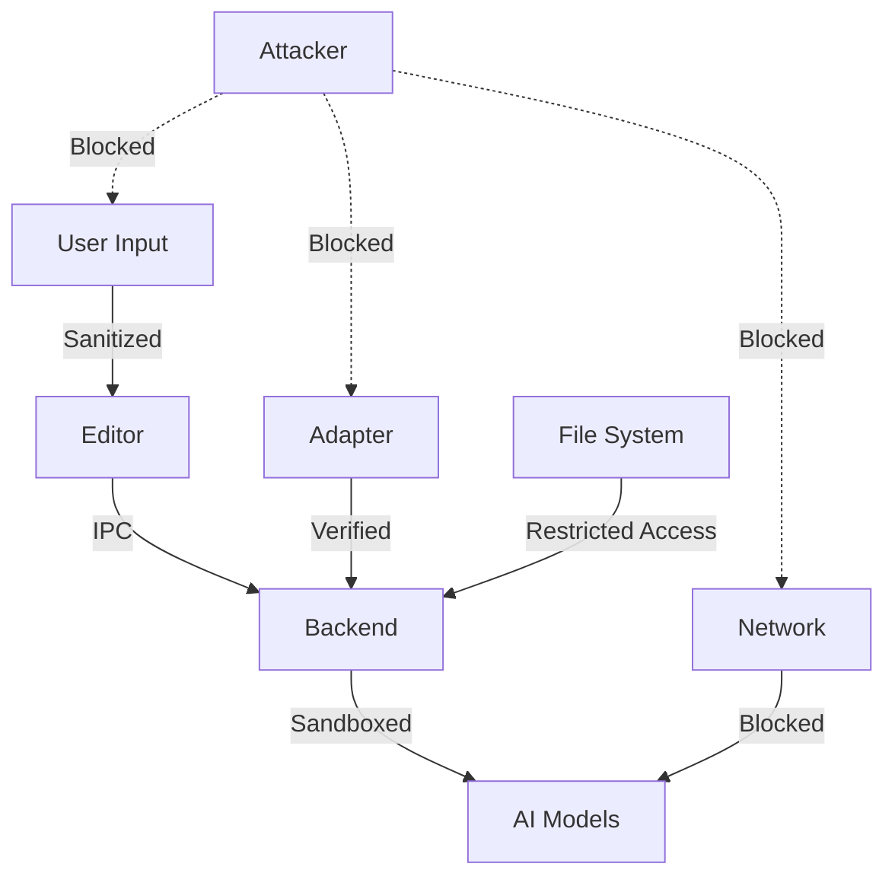

# Security Policy

## 🛡️ Security Philosophy

NeuralForge is built with a **security-first mindset**:
- **100% Local Execution**: No code ever leaves your machine
- **Zero Telemetry**: No usage data collection
- **Sandboxed Models**: AI models run in restricted environments
- **Verified Adapters**: Cryptographic signatures for community content
- **Open Source**: Full code transparency for security audits

---

## Supported Versions

We provide security updates for the following versions:

| Version | Supported          | End of Life |
| ------- | ------------------ | ----------- |
| 1.x.x   | ✅ Active Support  | TBD         |
| 0.9.x   | ⚠️ Security Only  | 2025-06-30  |
| < 0.9   | ❌ No Support     | Already EOL |

---

## 🚨 Reporting a Vulnerability

### For Security Issues

**DO NOT** create public GitHub issues for security vulnerabilities!

Instead, please report them via:
1. **Email**: security@neuralforge.dev
2. **Encrypted Email**: Use our PGP key (see below)
3. **GitHub Security Advisories**: [Private reporting](https://github.com/neuralforge/neuralforge/security/advisories/new)

### What to Include

Please provide:
- Description of the vulnerability
- Steps to reproduce
- Potential impact assessment
- Suggested fix (if any)
- Your contact information

### Response Timeline

- **Initial Response**: Within 24 hours
- **Status Update**: Within 72 hours
- **Fix Timeline**: Based on severity (see below)
- **Public Disclosure**: Coordinated after fix

### Severity Levels & Response

| Severity | Criteria | Fix Timeline | Example |
|----------|----------|--------------|---------|
| **Critical** | Remote code execution, data exfiltration | 24-48 hours | Model sandbox escape |
| **High** | Local privilege escalation, DoS | 3-5 days | Adapter verification bypass |
| **Medium** | Limited information disclosure | 1-2 weeks | Memory leak exposing data |
| **Low** | Minor issues, theoretical attacks | Next release | Verbose error messages |

---

## 🔒 Security Features

### 1. Model Sandboxing

All AI models run in restricted environments:

```java
// Models cannot:
- Access file system (except model directory)
- Make network connections
- Execute system commands
- Access environment variables
- Read process memory
- Spawn new processes
```

### 2. Adapter Verification

Community adapters undergo verification:

```bash
# Signature verification
neuralforge verify-adapter my-adapter.lora

# Checks performed:
✓ Cryptographic signature valid
✓ No malicious patterns detected
✓ Size within limits
✓ Structure validated
✓ Sandbox test passed
```

### 3. Input Sanitization

All user inputs are sanitized:

```java
public class InputSanitizer {
    // Prevent injection attacks
    - SQL injection prevention
    - Command injection blocking
    - Path traversal protection
    - XXE attack prevention
    - SSRF protection
}
```

### 4. Secure Communication

Internal IPC uses secure channels:

```yaml
IPC Security:
├── Named pipes (not network sockets)
├── Process isolation
├── Message authentication
├── No external network access
└── Encrypted sensitive data
```

---

## 🛠️ Security Best Practices

### For Users

1. **Keep Updated**
```bash
# Check for security updates
neuralforge --check-updates

# Update to latest version
neuralforge --update
```

2. **Verify Downloads**
```bash
# Verify installer checksum
sha256sum neuralforge-installer.exe
# Compare with official checksum
```

3. **Adapter Safety**
```bash
# Only install verified adapters
neuralforge install-adapter --verified-only

# Check adapter source
neuralforge info adapter-name
```

4. **Workspace Isolation**
```bash
# Use separate workspaces for sensitive projects
neuralforge --workspace ~/secure-project
```

### For Developers

1. **Secure Coding**
```java
// Always validate inputs
public void processCode(String code) {
    validateInput(code);  // Never skip!
    sanitizeCode(code);
    // ... process
}
```

2. **Dependency Management**
```bash
# Regular dependency audits
npm audit
./gradlew dependencyCheckAnalyze

# Update vulnerable dependencies immediately
npm audit fix
```

3. **Secrets Management**
```yaml
NEVER commit:
├── API keys
├── Passwords
├── Private keys
├── Personal data
└── Proprietary code
```

4. **Testing Security**
```bash
# Run security tests
npm run test:security
./gradlew securityTest

# Penetration testing
npm run pentest
```

---

## 🔐 Security Architecture

### Threat Model



### Security Boundaries

1. **Process Isolation**
   - Editor process (Electron)
   - Backend process (Java)
   - Model inference (Sandboxed)

2. **File System Restrictions**
```
Allowed Paths:
├── ~/workspace (read/write)
├── ~/.neuralforge/config (read/write)
├── ~/.neuralforge/adapters (read only)
└── /app/models (read only)

Blocked Paths:
├── System directories
├── Other user directories
├── Network mounts
└── Sensitive locations
```

3. **Network Isolation**
```yaml
Network Access:
├── Editor → Backend: Local IPC only
├── Backend → Models: In-process only
├── Models → External: BLOCKED
└── Adapter Download: Verified HTTPS only
```

---

## 🚫 Known Security Limitations

### Current Limitations

1. **Electron Security**
   - Based on Chromium (inherits its vulnerabilities)
   - Mitigation: Regular Electron updates

2. **Java Dependencies**
   - Third-party libraries may have vulnerabilities
   - Mitigation: Automated dependency scanning

3. **Model Security**
   - Models could theoretically memorize training data
   - Mitigation: Only train on public, licensed code

### Not Protected Against

- Physical access to machine
- Compromised operating system
- Malicious user with legitimate access
- Side-channel attacks (timing, power)
- Advanced persistent threats (APTs)

---

## 📋 Security Checklist

### For Every Release

- [ ] All dependencies updated
- [ ] Security scan passed
- [ ] No sensitive data in code
- [ ] Sandbox tests passed
- [ ] Input validation complete
- [ ] Error messages sanitized
- [ ] Logs don't leak information
- [ ] Cryptographic signatures updated

### For Adapter Publishers

- [ ] No proprietary code used
- [ ] No hardcoded secrets
- [ ] Dataset properly licensed
- [ ] Verification signature included
- [ ] Size under 100MB limit
- [ ] Documentation included
- [ ] No personal data exposed
- [ ] Security scan passed

---

## 🔍 Security Audits

### Internal Audits
- **Frequency**: Quarterly
- **Scope**: Full codebase
- **Tools**: OWASP dependency check, SonarQube, CodeQL

### External Audits
- **Frequency**: Annually
- **Scope**: Critical components
- **Reports**: Published publicly

### Bug Bounty Program
Coming soon! We plan to launch a bug bounty program for security researchers.

---

## 📞 Security Contacts

- **Email**: security@neuralforge.dev
- **PGP Key**: [Download](https://neuralforge.dev/pgp-key.asc)
- **Response Time**: 24 hours for critical issues

### PGP Key Fingerprint
```
1234 5678 90AB CDEF 1234 5678 90AB CDEF 1234 5678
```

---

## 🏛️ Security Hall of Fame

We thank the following security researchers for responsibly disclosing vulnerabilities:

| Researcher | Vulnerability | Date | Severity |
|------------|--------------|------|----------|
| *Your name here* | *Help us improve* | - | - |

---

## 📚 Security Resources

### For Learning
- [OWASP Top 10](https://owasp.org/www-project-top-ten/)
- [CWE/SANS Top 25](https://cwe.mitre.org/top25/)
- [Secure Coding Guidelines](https://wiki.sei.cmu.edu/confluence/)

### Tools We Use
- **Static Analysis**: SonarQube, CodeQL
- **Dependency Scanning**: OWASP Dependency Check
- **Runtime Protection**: Java Security Manager
- **Sandboxing**: System.SecurityManager + Custom Policies

---

## 🤝 Responsible Disclosure

We believe in responsible disclosure and will:
1. Work with researchers to understand issues
2. Provide credit (unless anonymity requested)
3. Fix vulnerabilities promptly
4. Coordinate disclosure timing
5. Never pursue legal action against good-faith researchers

---

## ⚖️ Legal

### Safe Harbor

We consider security research authorized if you:
- Make good faith effort to avoid harm
- Only test against your own instances
- Don't access others' data
- Report findings promptly
- Give us reasonable time to fix

We won't pursue legal action if these guidelines are followed.

---

## Updates to This Policy

This security policy may be updated. Major changes will be announced via:
- GitHub releases
- Discord announcement
- Security mailing list

Last Updated: October 2024

---

*Security is everyone's responsibility. Thank you for helping keep NeuralForge safe for all users.*