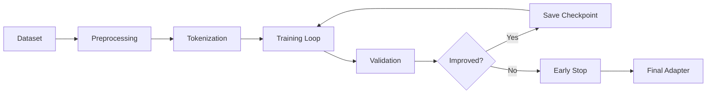

# 🧠 NeuralForge Training Guide

## Table of Contents
- [Overview](#overview)
- [Quick Start](#quick-start)
- [Understanding Adapters](#understanding-adapters)
- [Dataset Preparation](#dataset-preparation)
- [Training Pipeline](#training-pipeline)
- [Fine-tuning Models](#fine-tuning-models)
- [Creating Custom Adapters](#creating-custom-adapters)
- [Incremental Learning](#incremental-learning)
- [Optimization Techniques](#optimization-techniques)
- [Validation & Testing](#validation--testing)
- [Publishing Adapters](#publishing-adapters)
- [Troubleshooting](#troubleshooting)

---

## Overview

NeuralForge uses **LoRA (Low-Rank Adaptation)** for efficient fine-tuning:
- Train adapters in minutes, not hours
- Adapters are 10-100MB (vs full models at 1-15GB)
- Stack multiple adapters for combined expertise
- No GPU required (CPU training supported)

### Key Concepts
- **Base Model**: Frozen pre-trained model (CodeT5+, StableCode, etc.)
- **LoRA Adapter**: Small trainable weights added to base model
- **Incremental Learning**: Continuous improvement without forgetting
- **EWC**: Elastic Weight Consolidation to prevent catastrophic forgetting

---

## Quick Start

### 1. Train Your First Adapter

```bash
# Using your code history
neuralforge train --from-git ./my-project

# Using specific dataset
neuralforge train --dataset ./training-data.jsonl

# Interactive mode
neuralforge train --interactive
```

### 2. Test the Adapter

```bash
# Load and test
neuralforge test-adapter ./my-adapter.lora

# Compare with base model
neuralforge benchmark --adapter ./my-adapter.lora
```

### 3. Use in Editor

```bash
# Load adapter in editor
neuralforge --adapter ./my-adapter.lora

# Or load via UI
# Settings → AI → Adapters → Load Custom
```

---

## Understanding Adapters

### What is LoRA?

LoRA decomposes weight updates into low-rank matrices:

```
Original: W = W0 (frozen)
LoRA:     W = W0 + BA (trainable)

Where:
- B ∈ R^(d×r) (down projection)
- A ∈ R^(r×d) (up projection)  
- r << d (rank is much smaller than dimension)
```

### Benefits
- **Efficiency**: Only train 0.1-1% of parameters
- **Modularity**: Swap adapters on the fly
- **Composability**: Combine multiple adapters
- **Speed**: 10-100x faster than full fine-tuning

### Adapter Architecture

```yaml
Adapter Structure:
├── metadata.json      # Configuration
├── lora_weights.bin   # Trained weights
├── tokenizer.json     # Custom tokens (optional)
└── README.md         # Documentation

Size Breakdown (typical):
├── Rank 4:  ~10MB
├── Rank 8:  ~40MB
├── Rank 16: ~80MB
└── Rank 32: ~150MB
```

---

## Dataset Preparation

### Dataset Format

NeuralForge accepts multiple formats:

#### 1. JSONL Format (Recommended)
```jsonl
{"context": "public class User {", "completion": "private String name;", "language": "java"}
{"context": "def calculate_", "completion": "total(items):", "language": "python"}
{"context": "function render", "completion": "Component(props) {", "language": "javascript"}
```

#### 2. From Git History
```bash
# Automatically extract from commits
neuralforge extract-dataset --git-repo ./my-project \
  --output dataset.jsonl \
  --languages java,python,js
```

#### 3. From Code Files
```bash
# Parse code files into training data
neuralforge create-dataset --source ./src \
  --pattern "*.java" \
  --output dataset.jsonl
```

### Data Quality Guidelines

#### ✅ Good Training Data
- Your team's actual code
- Well-tested, production code
- Consistent style
- Properly licensed (Apache/MIT)
- Recent and relevant

#### ❌ Bad Training Data
- Random GitHub code
- Buggy or untested code
- Inconsistent styles
- Proprietary code
- Outdated patterns

### Dataset Preprocessing

```python
# preprocessing.py
import json
from typing import List, Dict

def preprocess_dataset(input_file: str, output_file: str):
    """Clean and prepare dataset for training"""
    
    processed = []
    with open(input_file, 'r') as f:
        for line in f:
            sample = json.loads(line)
            
            # Quality filters
            if len(sample['completion']) < 5:
                continue  # Too short
            
            if len(sample['context']) > 2048:
                continue  # Too long
            
            # Deduplication
            signature = hash(sample['context'] + sample['completion'])
            if signature not in seen:
                processed.append(sample)
                seen.add(signature)
    
    # Balance dataset
    processed = balance_by_language(processed)
    
    # Save processed dataset
    with open(output_file, 'w') as f:
        for sample in processed:
            f.write(json.dumps(sample) + '\n')
```

### Dataset Size Recommendations

| Use Case | Minimum Samples | Recommended | Training Time |
|----------|----------------|-------------|---------------|
| Personal Style | 100 | 500 | 5 minutes |
| Team Conventions | 500 | 2,000 | 15 minutes |
| Framework Patterns | 1,000 | 5,000 | 30 minutes |
| Language Specialty | 5,000 | 20,000 | 2 hours |

---

## Training Pipeline

### Configuration File

```yaml
# training-config.yaml
model:
  base: "codet5-770m"           # Base model to adapt
  adapter_name: "my-team-style"  # Adapter identifier

lora:
  rank: 8                        # LoRA rank (4, 8, 16, 32)
  alpha: 16                      # Scaling factor
  dropout: 0.1                   # Dropout rate
  target_modules:                # Modules to adapt
    - q_proj
    - v_proj

training:
  batch_size: 8                  # Batch size (adjust for memory)
  learning_rate: 0.0001         # Learning rate
  epochs: 3                      # Training epochs
  warmup_steps: 100             # LR warmup steps
  gradient_checkpointing: true  # Save memory
  fp16: true                    # Mixed precision

dataset:
  train_file: "train.jsonl"     # Training data
  eval_file: "eval.jsonl"       # Evaluation data
  max_length: 512               # Max sequence length

optimization:
  ewc_lambda: 0.5               # EWC regularization strength
  replay_buffer_size: 1000      # Samples to prevent forgetting
```

### Training Script

```bash
# Basic training
neuralforge train --config training-config.yaml

# With monitoring
neuralforge train --config training-config.yaml \
  --tensorboard ./logs \
  --checkpoint-dir ./checkpoints

# Distributed training (multiple GPUs)
neuralforge train --config training-config.yaml \
  --distributed \
  --gpus 2
```

### Training Stages



---

## Fine-tuning Models

### Basic Fine-tuning

```python
# train.py
from neuralforge.training import LoRATrainer
from neuralforge.models import load_base_model

# Load base model
model = load_base_model("codet5-770m")

# Initialize trainer
trainer = LoRATrainer(
    model=model,
    rank=8,
    alpha=16,
    target_modules=["q_proj", "v_proj"]
)

# Train
trainer.train(
    train_dataset="train.jsonl",
    eval_dataset="eval.jsonl",
    epochs=3,
    batch_size=8
)

# Save adapter
trainer.save_adapter("my-adapter.lora")
```

### Advanced Training Techniques

#### 1. Gradient Accumulation (For Limited Memory)
```python
trainer = LoRATrainer(
    gradient_accumulation_steps=4,  # Effective batch = 8 * 4 = 32
    batch_size=8
)
```

#### 2. Learning Rate Scheduling
```python
from neuralforge.training import CosineScheduler

scheduler = CosineScheduler(
    base_lr=0.0001,
    warmup_steps=100,
    total_steps=1000
)

trainer.train(lr_scheduler=scheduler)
```

#### 3. Mixed Precision Training
```python
trainer = LoRATrainer(
    fp16=True,  # Use 16-bit precision
    gradient_scaling=True
)
```

---

## Creating Custom Adapters

### Step-by-Step Adapter Creation

#### 1. Collect Training Data
```bash
# From your repository
neuralforge extract-dataset \
  --git-repo ./my-project \
  --since "6 months ago" \
  --output my-code.jsonl
```

#### 2. Split Dataset
```python
# split_dataset.py
import random

with open('my-code.jsonl') as f:
    lines = f.readlines()

random.shuffle(lines)
split = int(len(lines) * 0.9)

with open('train.jsonl', 'w') as f:
    f.writelines(lines[:split])

with open('eval.jsonl', 'w') as f:
    f.writelines(lines[split:])
```

#### 3. Configure Training
```yaml
# my-adapter-config.yaml
model:
  base: "codet5-770m"
  adapter_name: "my-coding-style"

lora:
  rank: 8
  alpha: 16
  
training:
  epochs: 5
  learning_rate: 0.0001
```

#### 4. Train Adapter
```bash
neuralforge train --config my-adapter-config.yaml
```

#### 5. Test & Validate
```bash
# Test on sample code
neuralforge test-adapter ./my-coding-style.lora \
  --test-file ./test-samples.jsonl

# Benchmark performance
neuralforge benchmark \
  --adapter ./my-coding-style.lora \
  --metrics accuracy,latency,perplexity
```

### Specialized Adapters

#### Framework-Specific Adapter
```yaml
# spring-boot-adapter.yaml
dataset:
  sources:
    - spring-boot-samples/
    - company-microservices/
  patterns:
    - "*Controller.java"
    - "*Service.java"
    - "*Repository.java"

training:
  focus_on:
    - annotations
    - dependency_injection
    - rest_mappings
```

#### Language-Specific Adapter
```yaml
# rust-adapter.yaml
dataset:
  language: rust
  features:
    - ownership_patterns
    - error_handling
    - trait_implementations

lora:
  rank: 16  # Higher rank for language-specific
```

---

## Incremental Learning

### Continuous Learning Setup

```python
# incremental_learning.py
class IncrementalLearner:
    def __init__(self, base_adapter):
        self.adapter = base_adapter
        self.replay_buffer = ReplayBuffer(size=1000)
        self.ewc = EWCRegularizer()
    
    def learn_from_session(self, new_data):
        # Mix new data with replay buffer
        mixed_data = self.mix_datasets(
            new_data, 
            self.replay_buffer.sample(100),
            ratio=0.8  # 80% new, 20% old
        )
        
        # Apply EWC regularization
        loss = self.compute_loss(mixed_data)
        loss += self.ewc.penalty() * 0.5
        
        # Update adapter
        self.update_adapter(loss)
        
        # Update replay buffer
        self.replay_buffer.add(new_data)
```

### Preventing Catastrophic Forgetting

#### Strategy 1: Elastic Weight Consolidation (EWC)
```python
# Preserve important weights
fisher_matrix = compute_fisher_information(model, old_data)
ewc_loss = sum(
    fisher[i] * (weight[i] - old_weight[i])**2
    for i in range(len(weights))
)
```

#### Strategy 2: Experience Replay
```python
# Maintain buffer of past examples
replay_buffer = ReplayBuffer(max_size=1000)
replay_samples = replay_buffer.sample(batch_size=32)
combined_batch = current_batch + replay_samples
```

#### Strategy 3: Progressive Neural Networks
```python
# Add new adapter without modifying old ones
adapters = {
    'base': original_adapter,
    'task1': task1_adapter,
    'task2': task2_adapter  # New task
}
combined_output = weighted_sum(adapters.values())
```

---

## Optimization Techniques

### Memory Optimization

```python
# Gradient checkpointing
trainer = LoRATrainer(
    gradient_checkpointing=True,  # Trade compute for memory
    batch_size=4,
    gradient_accumulation_steps=8
)
```

### Speed Optimization

```python
# Optimized data loading
dataloader = DataLoader(
    dataset,
    batch_size=32,
    num_workers=4,  # Parallel data loading
    pin_memory=True,  # Faster GPU transfer
    prefetch_factor=2
)
```

### Quantization-Aware Training

```python
# Train with quantization in mind
trainer = LoRATrainer(
    quantization_aware=True,
    target_bits=4  # Target INT4 quantization
)
```

---

## Validation & Testing

### Validation Metrics

```python
# metrics.py
def evaluate_adapter(adapter, test_set):
    metrics = {
        'accuracy': compute_accuracy(adapter, test_set),
        'perplexity': compute_perplexity(adapter, test_set),
        'latency': measure_latency(adapter),
        'memory': measure_memory_usage(adapter)
    }
    return metrics
```

### A/B Testing Adapters

```bash
# Compare two adapters
neuralforge ab-test \
  --adapter-a ./v1.lora \
  --adapter-b ./v2.lora \
  --test-data ./test.jsonl \
  --metrics accuracy,speed,memory
```

### Performance Benchmarks

| Metric | Baseline | Target | Your Adapter |
|--------|----------|--------|--------------|
| Accuracy | 75% | 80% | ___ |
| Latency | 50ms | 45ms | ___ |
| Memory | 100MB | 80MB | ___ |
| Perplexity | 15.0 | 12.0 | ___ |

---

## Publishing Adapters

### Prepare for Publishing

1. **Clean metadata**
```json
{
  "name": "spring-boot-expert",
  "version": "1.0.0",
  "base_model": "codet5-770m",
  "description": "Optimized for Spring Boot microservices",
  "author": "YourName",
  "license": "Apache-2.0",
  "training_samples": 5000,
  "accuracy": 0.85,
  "size_mb": 42
}
```

2. **Documentation**
```markdown
# Spring Boot Expert Adapter

## What it does
- Understands Spring annotations
- Follows REST conventions
- Generates proper error handling

## Best for
- Microservices development
- REST API creation
- Spring Data repositories

## Training data
- 50 production Spring Boot projects
- 5000+ code samples
- All Apache/MIT licensed
```

3. **Sign adapter**
```bash
neuralforge sign-adapter ./my-adapter.lora \
  --key ~/.neuralforge/private.key
```

### Publish to Marketplace

```bash
# Publish publicly
neuralforge publish \
  --adapter ./my-adapter.lora \
  --public \
  --tags "spring,java,microservices"

# Publish to team only
neuralforge publish \
  --adapter ./my-adapter.lora \
  --team my-company \
  --private
```

---

## Troubleshooting

### Common Issues

#### 1. Out of Memory During Training
```bash
# Reduce batch size
--batch-size 2

# Enable gradient checkpointing
--gradient-checkpointing

# Use CPU instead of GPU
--device cpu
```

#### 2. Adapter Not Improving
```python
# Check data quality
neuralforge analyze-dataset ./train.jsonl

# Try different hyperparameters
--learning-rate 0.00005
--rank 16
--epochs 5
```

#### 3. Slow Training
```bash
# Use mixed precision
--fp16

# Reduce sequence length
--max-length 256

# Use smaller rank
--rank 4
```

#### 4. Overfitting
```python
# Add dropout
--dropout 0.2

# Reduce epochs
--epochs 2

# Add more diverse data
```

### Debug Mode

```bash
# Verbose training output
neuralforge train --debug \
  --log-level DEBUG \
  --profile-memory \
  --track-gradients
```

### Performance Profiling

```python
# profile_training.py
import cProfile
import pstats

profiler = cProfile.Profile()
profiler.enable()

# Run training
train_adapter()

profiler.disable()
stats = pstats.Stats(profiler)
stats.sort_stats('cumulative')
stats.print_stats(20)  # Top 20 functions
```

---

## Advanced Topics

### Multi-Task Learning

```python
# Train adapter for multiple tasks
tasks = {
    'completion': weight=0.5,
    'bug_detection': weight=0.3,
    'documentation': weight=0.2
}

multi_task_trainer = MultiTaskTrainer(tasks)
multi_task_trainer.train()
```

### Federated Learning

```python
# Contribute to global model without sharing data
federated_client = FederatedClient("neuralforge-network")
federated_client.train_local(local_data)
federated_client.share_gradients()  # Privacy-preserved
```

### Custom Loss Functions

```python
def custom_loss(predictions, targets, context):
    # Standard cross-entropy
    ce_loss = cross_entropy(predictions, targets)
    
    # Syntax correctness penalty
    syntax_penalty = check_syntax_errors(predictions)
    
    # Style consistency reward
    style_reward = measure_style_consistency(predictions, context)
    
    return ce_loss + 0.1 * syntax_penalty - 0.05 * style_reward
```

---

## Resources

### Example Datasets
- [CodeSearchNet](https://github.com/github/CodeSearchNet) - Multi-language code
- [The Stack](https://huggingface.co/datasets/bigcode/the-stack) - Permissively licensed code
- [CodeParrot](https://huggingface.co/datasets/codeparrot/github-code) - Clean GitHub code

### Tools
- **Dataset Creator**: `neuralforge create-dataset`
- **Training Monitor**: `neuralforge monitor`
- **Adapter Manager**: `neuralforge adapters`

### Community
- Share adapters: [marketplace.neuralforge.dev](https://marketplace.neuralforge.dev)
- Get help: [Discord #training](https://discord.gg/neuralforge)
- Examples: [github.com/neuralforge/adapter-examples](https://github.com/neuralforge/adapter-examples)

---

*Remember: Good training data is more important than sophisticated algorithms. Start with your own code!*